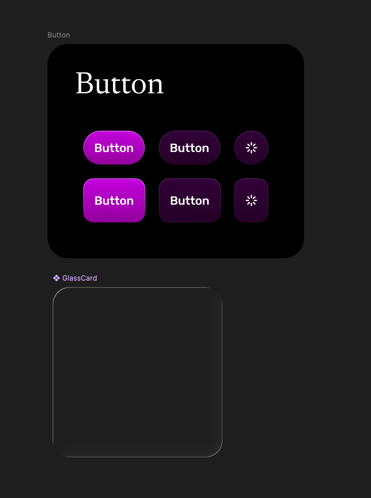

<p align="center">
  
</p>

<p align="center">
  
</p>

# Hexoo

Hexoo is a lightweight social posting app focused on a simple chronological feed, quick interactions, and basic content moderation.

The project started as a learning project and gradually evolved into a more complete full-stack application with authentication, user-generated content, reusable UI components, moderation flow, and production deployment.

## Design

The interface is designed in Figma and includes application screens, reusable components, and layout states.

Link : https://www.figma.com/design/KurhjgFX2T3eJUp7jLIatB/HEXOO-Design-v-2.0?node-id=149-7692&p=f&t=uI8gbdBg5yeufQ2Y-0



## Overview

Hexoo is built around a simple idea: posting should feel direct, fast, and low-pressure.

There are no recommendation algorithms, no engagement ranking, and no manipulated feed order. The app focuses on a straightforward timeline, user profiles, comments, reactions, and moderation tools for handling harmful or extreme content.

The project is currently used as a portfolio-ready full-stack application and a place for improving product design, frontend architecture, and backend integration.

## Main features

- User registration and login
- Chronological post feed
- Text posts, image posts, and YouTube link support
- Comments and reactions
- User profiles
- Basic moderator flow for content review
- Content moderation support
- reCAPTCHA protection
- Responsive interface
- Reusable UI components
- Production deployment

## Tech stack

- Next.js
- React
- TypeScript
- Supabase
- PostgreSQL
- Tailwind CSS
- TanStack Query
- Zustand
- Zod
- OpenAI API
- reCAPTCHA

<!-- ## Screenshots -->

<!-- Add or update screenshots in ./docs/images/ -->

<!--  -->

<!-- Suggested screenshots to add later:


-->

## Project structure

```txt
src/
  app/          Next.js app routes
  features/     Feature-based application modules
  lib/          Shared utilities and integrations
  styles/       Global styles

supabase/       Supabase-related configuration and database files
docs/           Project images and documentation assets
```

## Technical scope

Hexoo includes several areas commonly found in real-world web applications:

- authentication and protected user flows
- user-generated content
- database-backed posts, comments, reactions, and profiles
- form validation
- server-side and client-side application logic
- external API integration
- moderation-related flows
- reusable frontend components
- responsive UI implementation
- deployment-ready configuration

## Status

Hexoo is active and maintained in a slower development mode.

Current focus:

- improving project presentation and documentation
- refining the interface and design system
- improving moderation and safety flows
- polishing responsive views
- preparing a clearer public case study for recruiters and visitors

## Project review

The project is intended to be reviewed through:

- code
- the live application
- the source code
- screenshots
- the Figma design file

Local setup instructions are intentionally omitted because the application depends on private environment variables, Supabase configuration, external API keys, and production-specific services.

## License

This repository is source-available for viewing and reference only.

No permission is granted to copy, modify, redistribute, sublicense, or use this code, in whole or in part, without prior written permission from the author.
